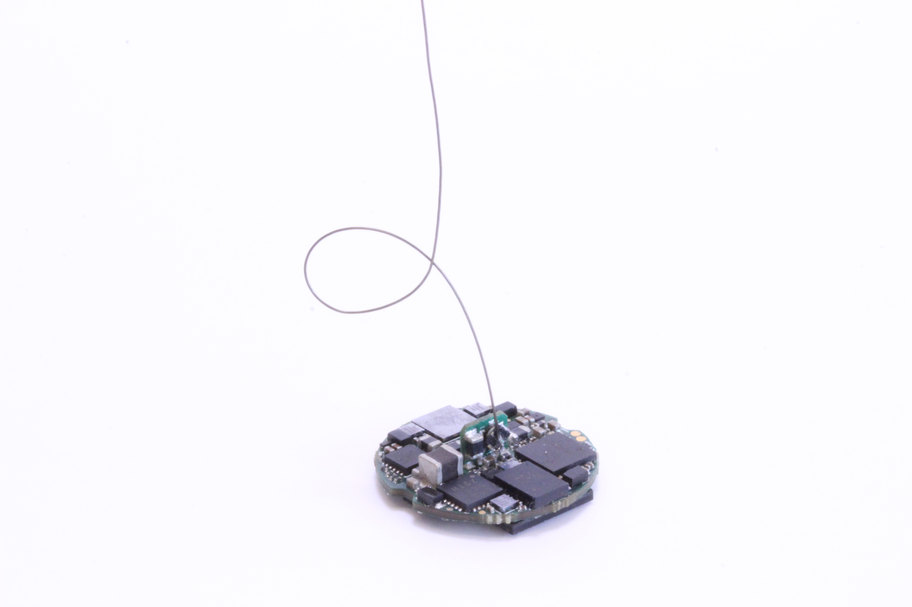

# ONIX 64-Channel Headstage
Serialized, multifunction headstage for wire electrode or silicon probe recordings.

- 64x electrophysiology channels
- 3x auxiliary analog channels (1x used by for stimulation current loop-back by
  default)
- 2x optical stimulation channels (LEDs or laser diodes; 800 mA per channel)
- 1x electrical stimulator (±2.5 mA, ±15V compliance; automatic discharge circuit)
- Integrated real-time, room-scale 3D-position tracking
- Integrated absolute orientation tracking

 
 
 
 
 
 
 
 

